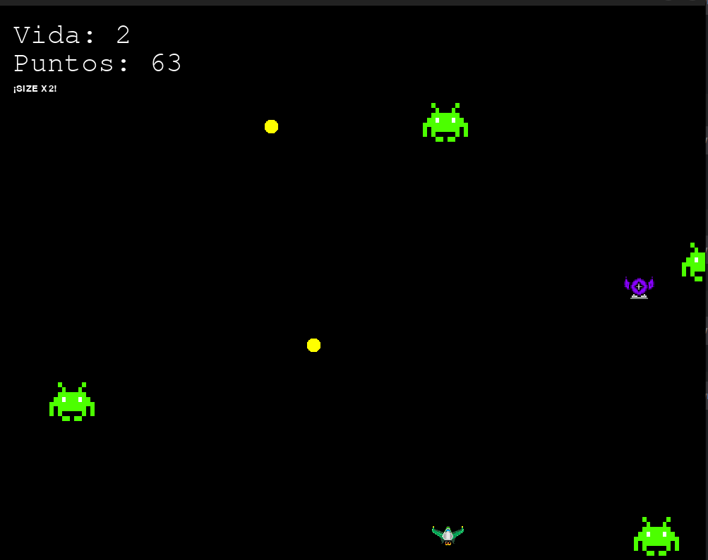

# Bitácora de Aprendizaje: Desarrollo en C, C++ y Python  

**Repositorio de proyectos y ejercicios de programación**  

Este repositorio documenta mi proceso de aprendizaje autónomo y complementario a mi formación universitaria sobre los lenguajes C y C++, además de profundizar en áreas de Python que aún no he explorado. Incluye desde ejercicios fundamentales hasta un proyecto completo: un videojuego desarrollado con Pygame.  

## 📌 Información General  
- **Autor**: Jorge Ruiz López  
- **Periodo de desarrollo**: Mayo 2024 - Septiembre 2024 (en progreso)  
- **Lenguajes**:     
- **Tecnologías**:   
- **Idiomas de documentación**: Español e Inglés  

## 🏗️ Estructura del Repositorio  

```
├── C/                  # Ejercicios y proyectos en C
├── C++/                # Ejercicios y proyectos en C++ 
├── interesting/        # Códigos destacados y proyectos avanzados (C/C++)
└── python_game/        # Videojuego desarrollado con Pygame (assets + código fuente)
```

## 🎯 Detalles Técnicos  

### 📚 Aprendizaje de C  
- **Metodología**: Seguí el enfoque del libro *"The C Programming Language" (Kernighan & Ritchie)*, completando todos sus ejercicios y proyectos.  
- **Enfoque**: Dominio de punteros, estructuras de datos, gestión de memoria y paradigma estructurado.
- **Ampliación a C++**: Manejo de estructuras de datos complejas e iniciación a orientación a objetos. Desarrollo de algoritmos básicos de manejo de listas enlazadas, árboles, grafos...

### 🕹️ Proyecto Pygame  
- **Conceptos aplicados**: POO, patrones de diseño, gestión de assets y lógica de juego  
- **Preview**:  
   

#### 🔧 Instrucciones para ejecutarlo

1. Clona el repositorio:
   ```bash
   git clone https://github.com/jorge-ruizl-um-es/polyglot-programming.git
   cd python_game
   ```

2. Crea y activa un entorno virtual:
   ```bash
   python -m venv venv
   source venv/bin/activate   # Linux/Mac
   venv\Scripts\activate  # Windows
   ```

3. Instalar dependencias:
   ```bash
   pip install -r requirements.txt
   ```

4. Ejecuta el juego:
   ```bash
   python my_game.py
   ```

### 🚀 Próximos Objetivos  
- [ ] Profundizar en C++ moderno (C++11/14/17)  
- [ ] Implementar pruebas unitarias en proyectos C/C++  
- [ ] Añadir sistema de partículas al videojuego  

## 📬 Colaboración  
Al ser un repositorio de aprendizaje, ¡todo consejo o aportación son más que bienvenidos! Puedes:  
- Reportar issues con mejoras  
- Proponer ejercicios/challenges interesantes  
- Compartir recursos de aprendizaje

## Créditos

Desarrollado por Jorge Ruiz López ([jorge.rulo2005@gmail.com](mailto:jorge.rulo2005@gmail.com)) con fines educativos, de aprendizaje propio y de mejora de habilidades personales en el ámbito de la programación. 
